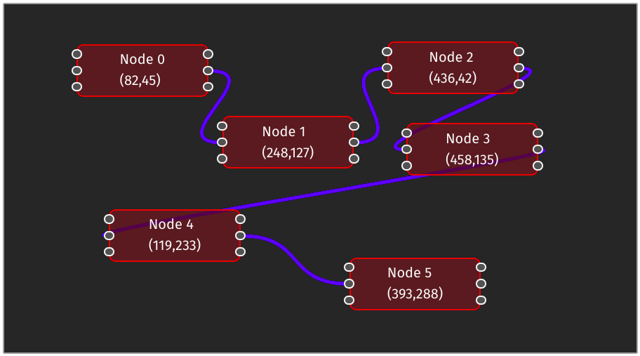

# yew-flow

WIP Node/Flow editor library in yew.rs

## Documentation

- For `trunk` serve config refer: [https://trunkrs.dev/assets/](https://trunkrs.dev/assets/).
- Trunk cargo workspace [issue](https://github.com/thedodd/trunk/issues/386).
- [tailwind-cli-with-yew-and-trunk](https://www.matsimitsu.com/blog/2022-01-04-taliwind-cli-with-yew-and-trunk)
- [How to set up Tailwind CSS with Yew and Trunk](https://dev.to/arctic_hen7/how-to-set-up-tailwind-css-with-yew-and-trunk-il9).
- [Enable tailwind intellisense in Rust](https://github.com/tailwindlabs/tailwindcss-intellisense/issues/546)